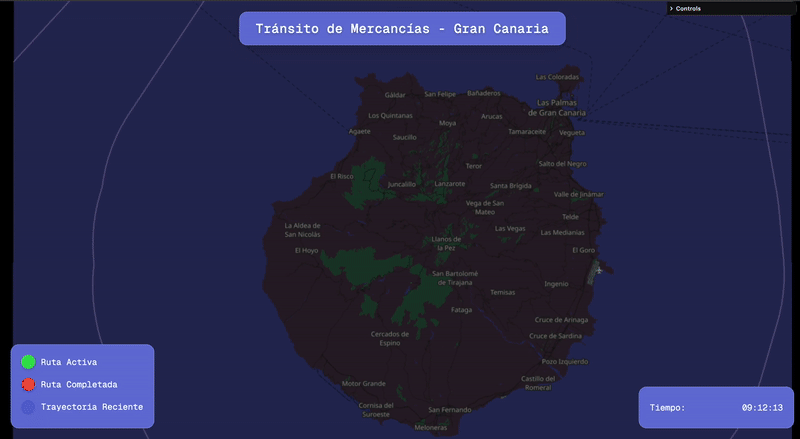
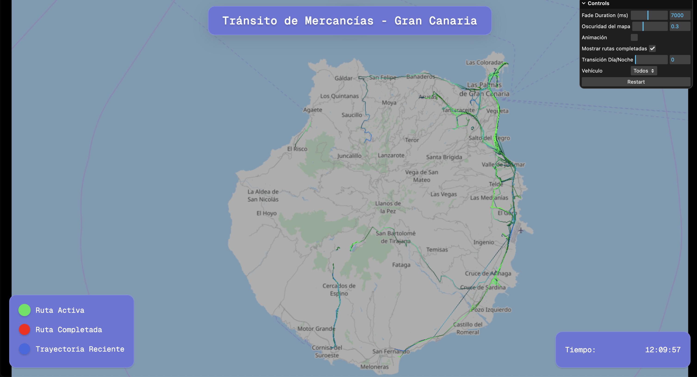
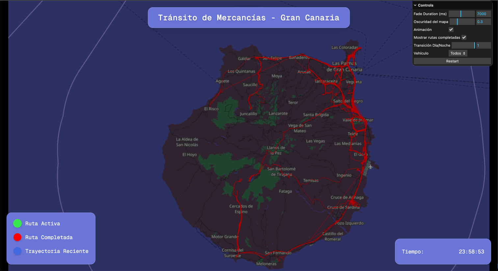

# Visualización Interactiva de Rutas de Vehículos en Gran Canaria




## Índice

- [Visualización Interactiva de Rutas de Vehículos en Gran Canaria](#visualización-interactiva-de-rutas-de-vehículos-en-gran-canaria)
  - [Índice](#índice)
  - [📖 Descripción](#-descripción)
  - [🚀 Características](#-características)
    - [🗺️ Visualización](#️-visualización)
    - [🎨 Efectos Visuales](#-efectos-visuales)
    - [🎮 Controles](#-controles)
  - [🛠️ Tecnologías](#️-tecnologías)
    - [Frontend](#frontend)
    - [Backend](#backend)
  - [Instalación](#instalación)
    - [Prerrequisitos](#prerrequisitos)
    - [Pasos de Instalación](#pasos-de-instalación)
  - [💻 Uso](#-uso)
  - [Funcionamiento Interno](#funcionamiento-interno)
    - [Carga de Mapas](#carga-de-mapas)
    - [Procesamiento de Datos](#procesamiento-de-datos)
    - [Shaders Personalizados](#shaders-personalizados)
      - [Carga de Texturas](#carga-de-texturas)
      - [ShaderMaterial para el Mapa](#shadermaterial-para-el-mapa)
      - [Vertex Shader](#vertex-shader)
      - [Fragment Shader](#fragment-shader)
      - [Interacción con la Interfaz Gráfica](#interacción-con-la-interfaz-gráfica)
    - [Interfaz Gráfica](#interfaz-gráfica)
  - [Personalización](#personalización)
  - [Capturas de Pantalla](#capturas-de-pantalla)
    - [Mapa Diurno con Rutas Activas](#mapa-diurno-con-rutas-activas)
    - [Mapa Nocturno con Rutas Completadas](#mapa-nocturno-con-rutas-completadas)

## 📖 Descripción

Este proyecto es una aplicación web interactiva que permite visualizar las rutas de una flota de vehículos en la isla de Gran Canaria. Utilizando **Three.js** y **shaders personalizados**, se representa el movimiento de los vehículos sobre un mapa, ofreciendo una experiencia visualmente atractiva e informativa.

## 🚀 Características

### 🗺️ Visualización
- Mapa interactivo 3D con controles OrbitControls
- Transición día/noche con shaders personalizados
- Sistema de tiles dinámico basado en coordenadas GPS

### 🎨 Efectos Visuales
- Shaders GLSL para efectos de desvanecimiento
- Efectos de plasma para rutas completadas
- Partículas pulsantes para rutas activas
- Sistema de mezcla de mapas día/noche

### 🎮 Controles
- GUI interactiva con lil-gui
- Filtrado de rutas por vehículo
- Control de tiempo y animación
- Ajustes de visualización en tiempo real

## 🛠️ Tecnologías

### Frontend
- **Three.js**: Motor de renderizado 3D
- **GLSL**: Shaders personalizados para efectos visuales
- **lil-gui**: Interfaz de usuario para controles
- **Thunderforest Maps**: Proveedor de tiles para mapas diurnos y nocturnos.
- **OpenStreetMap**: Fuente de datos para mapas base

### Backend
- **Node.js**: Runtime de JavaScript
- **Express**: Servidor web minimalista
- **ES6 Modules**: Sistema de módulos nativo

## Instalación

### Prerrequisitos

- **Node.js** (versión 12 o superior)
- **npm** o **yarn**

### Pasos de Instalación

1. **Clona el repositorio**:

   ```bash
   git clone https://github.com/gitfrandu4/visualizacion-rutas-vehiculos.git
   ```

2. **Navega al directorio del proyecto**:

   ```bash
   cd visualizacion-rutas-vehiculos
   ```

3. **Instala las dependencias**:

   ```bash
   npm install
   ```

4. **Inicia la aplicación**:

   ```bash
   npm start
   ```

5. **Abre tu navegador** e ingresa a `http://localhost:3000`.

## 💻 Uso

- **Controles del Mapa**:

  * 🖱️ Click Izquierdo + Arrastrar: Rotar vista
  * 🖱️ Click Derecho + Arrastrar: Pan
  * 🖱️ Rueda: Zoom

- **Panel de Control (lil.GUI)**:

  - **Atenuación (ms)**: Controla la duración del efecto de desvanecimiento de las rutas.
  - **Oscuridad del mapa**: Ajusta la luminosidad del mapa base.
  - **Transición Día/Noche**: Controla la mezcla entre mapas diurnos y nocturnos.
  - **Vehículo**: Filtra la visualización por identificador de vehículo.
  - **Animación**: Pausa o reanuda la animación de las rutas.
  - **Mostrar rutas completadas**: Muestra u oculta las rutas ya completadas.
  - **Reiniciar**: Reinicia la animación al tiempo inicial.

## Funcionamiento Interno

### Carga de Mapas

Se utilizan tiles de **Thunderforest** para los mapas diurnos y nocturnos. Los tiles se cargan dinámicamente según la posición y nivel de zoom, y se combinan mediante shaders para permitir la transición suave entre día y noche.

> [!IMPORTANT]
> Reemplaza las claves de API de Thunderforest con las tuyas propias en el código.

### Procesamiento de Datos

- **Carga de Datos**: Los datos de las coordenadas de los vehículos se cargan desde `vehicle-coordinates.csv`.
- **Procesamiento**: Se agrupan y ordenan las coordenadas por vehículo y tiempo.
- **Generación de Trayectorias**: Se crean geometrías de líneas para cada vehículo utilizando las coordenadas procesadas.

### Shaders Personalizados

Se utilizan shaders para:

- **Efecto de Desvanecimiento**: Las rutas se desvanecen con el tiempo según la configuración de fade.
- **Visualización de Rutas Completadas**: Las rutas finalizadas muestran un efecto de plasma para diferenciarlas.
- **Transición Día/Noche**: Se mezcla el mapa diurno y nocturno según el factor de transición establecido.

#### Carga de Texturas

Para cada tile, se cargan dos texturas: una versión diurna y otra nocturna. Las URLs de los tiles son las siguientes:

```js
const urlDay = `https://a.tile.openstreetmap.org/${zoom}/${x}/${y}.png`;
const urlNight = `https://b.tile.openstreetmap.org/${zoom}/${x}/${y}.png`;
```

#### ShaderMaterial para el Mapa

Se utiliza un **ShaderMaterial** que combina las texturas de día y noche. La combinación se controla mediante un parámetro de mezcla (`blendFactor`), lo que permite una transición suave entre ambas versiones del mapa. También se incluye un parámetro de oscuridad (`darkness`) para ajustar la luminosidad del mapa.

```js
const material = new THREE.ShaderMaterial({
  uniforms: {
    textureDay: { value: textureDay },
    textureNight: { value: textureNight },
    blendFactor: { value: guiParams.blendFactor },
    darkness: { value: guiParams.guiDarkness },
  },
  vertexShader: `...`,
  fragmentShader: `...`,
});
```

#### Vertex Shader

El vertex shader transmite las coordenadas de textura de los vértices al fragment shader.

```js
varying vec2 vUv;
void main() {
  vUv = uv;
  gl_Position = projectionMatrix * modelViewMatrix * vec4(position, 1.0);
}
```

- **`vUv`**: Transfiere las coordenadas de textura al fragment shader.
- **`gl_Position`**: Calcula la posición del vértice en el espacio de proyección.

#### Fragment Shader

El fragment shader combina las texturas de día y noche y aplica un efecto de oscuridad.

```js
uniform sampler2D textureDay;
uniform sampler2D textureNight;
uniform float blendFactor;
uniform float darkness;
varying vec2 vUv;
void main() {
  vec4 colorDay = texture2D(textureDay, vUv);
  vec4 colorNight = texture2D(textureNight, vUv);
  vec4 finalColor = mix(colorDay, colorNight, blendFactor);
  finalColor.rgb *= 1.0 - darkness; // Aplicar oscuridad
  gl_FragColor = finalColor;
}
```

- **Uniformes**:
  - **`textureDay`** y **`textureNight`**: Texturas del mapa para día y noche.
  - **`blendFactor`**: Controla la mezcla entre las texturas diurna y nocturna.
  - **`darkness`**: Ajusta el nivel de oscuridad aplicado al mapa.

- **Proceso**:
  1. Se obtienen los colores de las texturas de día y noche en las coordenadas `vUv`.
  2. Se combinan los colores usando `mix` y el valor de `blendFactor`.
  3. Se aplica la oscuridad multiplicando el color resultante por `(1.0 - darkness)`.
  4. Se asigna el color final a `gl_FragColor`.

#### Interacción con la Interfaz Gráfica

La interfaz gráfica permite ajustar dinámicamente los parámetros `blendFactor` y `darkness` para personalizar la visualización del mapa.

```js
gui.add(guiParams, 'blendFactor', 0, 1).name('Transición Día/Noche').onChange((value) => {
  mapa.children.forEach((mesh) => {
    mesh.material.uniforms.blendFactor.value = value;
  });
});

gui.add(guiParams, 'guiDarkness', 0.0, 1.0).name('Oscuridad del mapa').onChange((value) => {
  mapa.children.forEach((mesh) => {
    mesh.material.uniforms.darkness.value = value;
  });
});
```

### Interfaz Gráfica

Utilizando **lil.GUI**, se proporciona una interfaz intuitiva para que el usuario pueda ajustar parámetros en tiempo real y observar los cambios inmediatamente en la visualización.

## Personalización

Puedes personalizar varios aspectos del proyecto:

- **Claves de API de Mapas**: Reemplaza las claves de API de Thunderforest con las tuyas propias en el código.
- **Datos de Vehículos**: Actualiza o reemplaza `vehicle-coordinates.csv` con tus propios datos.
- **Parámetros Iniciales**: Ajusta los valores predeterminados en `server.js` para cambiar la configuración inicial.

## Capturas de Pantalla

### Mapa Diurno con Rutas Activas



### Mapa Nocturno con Rutas Completadas


